# CEC - Cross Entropy Clustering 

<!-- badges: start -->
[](https://github.com/swarm-lab/cec/actions/workflows/R-CMD-check.yaml)
[](https://app.codecov.io/gh/swarm-lab/cec?branch=master)
[](https://cran.r-project.org/package=CEC)
[](https://cran.r-project.org/package=CEC)
<!-- badges: end -->

## Description

[`CEC`](https://github.com/swarm-lab/cec) is an [`R`](https://cran.r-project.org)
package that performs data points clustering using the cross–entropy clustering 
(CEC) method[^1]. This method has been developed based on information theory and 
combines the speed and simplicity of k-means with the ability to use various 
Gaussian mixture models and automatically remove unnecessary clusters.

[^1]: Tabor, J., & Spurek, P. (2014). Cross-entropy clustering. Pattern 
Recognition, 47(9), 3046–3059. https://doi.org/10.1016/j.patcog.2014.03.006

---

## Installation

[`CEC`](https://github.com/swarm-lab/cec) can be installed directly from 
[CRAN](https://cran.r-project.org/) as follows:

```R
install.packages("CEC")
```

You can also use the [`remotes`](https://remotes.r-lib.org/) package to install 
the development version of [`CEC`](https://github.com/swarm-lab/cec) as follows: 

```R
remotes::install_github("swarm-lab/cec")
```

---

## Basic usage

The core function of the [`CEC`](https://github.com/swarm-lab/cec) package is 
the `cec` function. In the simplest scenario, this function requires only two 
arguments: an input data matrix (`x`) and the initial number of cluster centers 
(`centers`). For instance, here is how to identify two clusters in the waiting 
times between eruptions for the Old Faithful geyser in Yellowstone National Park, 
Wyoming, USA: 

```r
library("CEC")
data("faithful")
clusters <- cec(as.matrix(faithful[, 2, drop = FALSE]), 2)
clusters
```

The function `cec` returns the following important information: 

+ `clusters$cluster`: the cluster membership of each data point;
+ `clusters$centers`: the coordinates of the centers of each cluster;
+ `clusters$covariances.model`: the model covariance of each cluster;
+ `clusters$probability`: the probability that a random data point belongs to a
 given cluster. 

Additional information concerning the number of iterations, the cost (energy) 
function, and the number of clusters at each iteration are also available.

You can now plot the results of the clustering process as follows: 

```r
hist(faithful$waiting, prob = TRUE, main = "Time between Old Faithful eruptions", 
     xlab = "Minutes", col = "lightgray", border = 0, ylim = c(0, 0.05))

for (i in c(1:2)) {
    curve(cec$probability[i] * dnorm(x, mean = cec$centers[i], 
                                     sd = sqrt(cec$covariances.model[[i]][1])),
          add = T, col = i + 1, lwd = 2)  
}
```

<p align="center">
  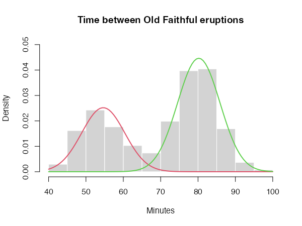
</p>

---

## Cluster initialization

Like k-means, the quality of the results produced by CEC depends on the choice 
of initial cluster centers. The initial locations of the centers can be chosen 
using the `centers.init` parameter of the `cec` function. It can be set to
`"random"` to select the initial centers randomly, or to `"kmeans++"` to select 
them via the [k-means++ method](https://en.wikipedia.org/wiki/K-means%2B%2B). It 
is also recommended to run the clustering algorithm multiple times with 
different cluster centers. This can easily be achieved using the `nstart` 
parameter. For instance,

```r
clusters <- cec(as.matrix(faithful[, 2, drop = FALSE]), 2, method = "kmeans++", 
    nstart = 10, threads = 4)
clusters
```

will run the clustering algorithm 10 times, initializing it each time with the 
output of the k-means++ algorithm. Only the best of the 10 runs (i.e. the run
with the lowest cost function) will be returned by the function.

Note that, when `nstart > 1`, the clustering process can be sped-up by running 
it in parallel threads using the `threads` parameter (more details in the 
package manual).

---

## Other important parameters

`card.min` represents the minimal cluster size, i.e. the number of points below 
which a cluster is removed from the analysis. It can be expressed as a number of 
points or as a percentage of the data set size. 

`iter.max` is the maximum allowed number of iterations of the algorithm at each 
start. If the algorithm does not converge before `iter.max` is reached, the 
function will stop and return the best result so far. 

---

## Available Gaussian distributions

One of the most important properties of the CEC algorithm is that it can 
combined various Gaussian models in the same clustering process. The CEC package 
includes six Gaussian models, which can be specified via the parameter `type`.
These models are: 

### General Gaussian distributions

**`type = "all"`**

The general Gaussian CEC algorithm gives similar results to those obtained by 
Gaussian Mixture Models. However, the CEC does not use the EM (Expectation 
Maximization) approach for minimization but a simple iteration process (Hartigan 
method). Consequently, larger data sets can be processed in shorter time.

CEC will have a tendency to divide the data into clusters in the shape of 
ellipses (ellipsoids in higher dimensions). For instance: 

```r
data("fourGaussians")
cec <- cec(fourGaussians, centers = 10, type = "all", nstart = 20)
plot(cec, asp = 1)
```

<p align="center">
  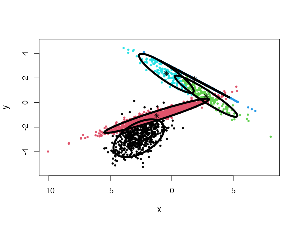
</p>

### Spherical distributions 

**`type = "spherical"`**

The original distribution will be approximated by spherical (radial) densities, 
which will result in splitting the data into disk-like clusters of arbitrary 
sizes (spheres in higher dimensions). 

```r
data("Tset")
cec <- cec(x = Tset, centers = 10, type = "spherical", nstart = 5)
plot(cec, asp = 1)
```

<p align="center">
  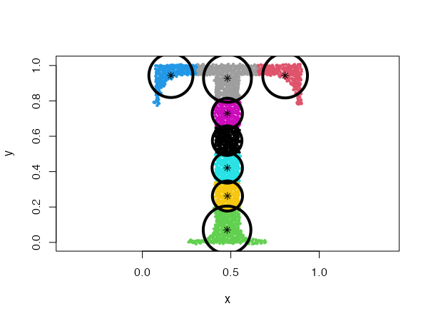
</p>

### Spherical distributions with fixed radius

**`type = "fixedr"`**

Similarly to the general spherical model, the data set will be divided into 
clusters resembling disks, but with their radius determined by the `param` 
argument.

```r
data("Tset")
cec <- cec(x = Tset, centers = 10, type = "fixedr", param = 0.01, nstart = 20)
plot(cec, asp = 1)
```

<p align="center">
  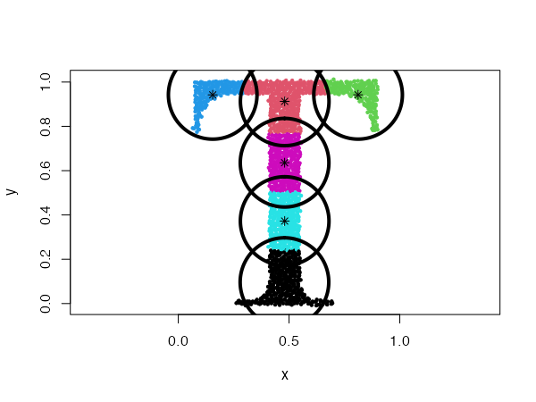
</p>

### Diagonal distributions

**`type = "diagonal"`**

In this case, the data will be described by ellipses for which the main 
semi-major axes are parallel to the axes of the coordinate system. 

```r
data("Tset")
cec <- cec(x = Tset, centers = 10, type = "diagonal", nstart = 5)
plot(cec, asp = 1)
```

<p align="center">
  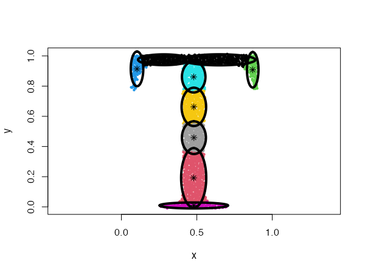
</p>

### Fixed covariance distributions

**`type = "covariance"`**

This model clusters the data using Gaussians with a fixed covariance. The 
covariance matrix is passed to the `param` argument. 

```r
data("Tset")
cec <- cec(x = Tset, centers = 10, card.min = '10%', type = "covariance",  
    param = matrix(c(0.04,  0, 
                     0,     0.01), 2))
plot(cec, asp = 1)
```

<p align="center">
  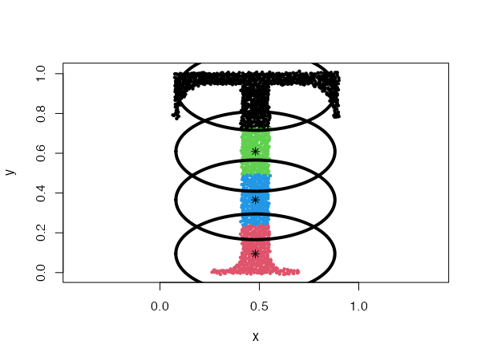
</p>

### Fixed eigenvalues distributions

**`type = "eigenvalues"`**

This is similar to the previous example, but here the Gaussians have fixed 
eigenvalues. The eigenvalues are passed to the `param` argument. 

```r
data("Tset")
cec <- cec(x = Tset, centers = 10, type = "eigenvalues", param = c(0.01, 0.001), 
    nstart = 5)
plot(cec, asp = 1)
```

<p align="center">
  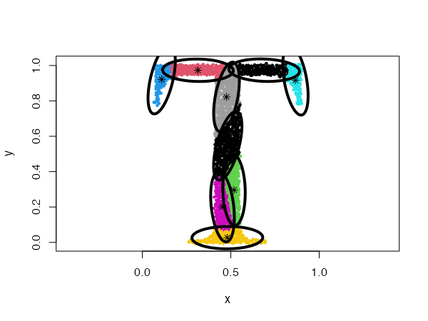
</p>

### Fixed mean distributions

**`type = "mean"`**

In this condition, the data is clustered using Gaussians with fixed mean values.
The mean values of the data dimensions are passed to the `param` argument. 

```r
data("Tset")
cec <- cec(Tset, 4, "mean", param = c(0.48, 0.48), nstart = 5)
plot(cec, asp = 1)
```

<p align="center">
  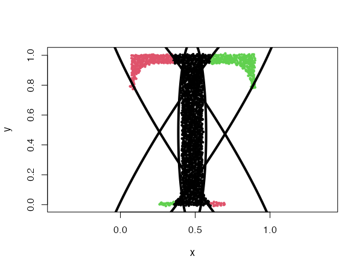
</p>

```r
data("threeGaussians")
cec <- cec(threeGaussians,4, "mean", param = c(0, 0), nstart = 10)
plot(cec)
```

<p align="center">
  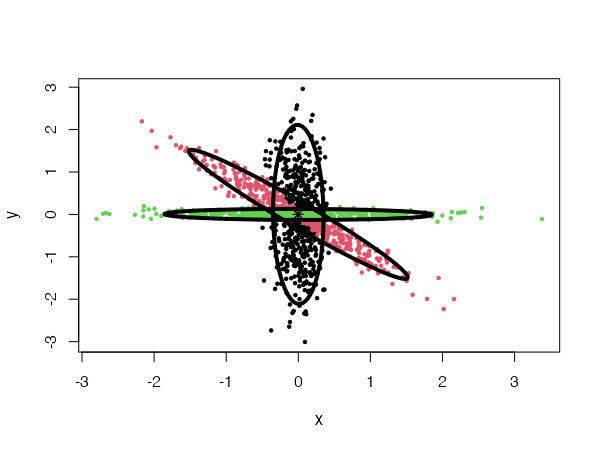
</p>

---

## Mixing Gaussian distributions

One of the most powerful properties of the CEC algorithm is the possibility of 
mixing Gaussian models together. More precisely, the mixed models can be 
specified by giving a list of cluster types (and a list of corresponding 
parameters, if needed).

```r
data("mixShapes")
cec <- cec(mixShapes, 7, iter.max = 3, 
    type = c("fixedr", "fixedr", "eigen", "eigen",  "eigen", "eigen", "eigen"),  
    param = list(350, 350, c(9000, 8), c(9000, 8), 
                 c(9000, 8), c(9000, 8), c(9000, 8)), 
    nstart = 500, threads = 10)
plot(cec, asp = 1)
```

<p align="center">
  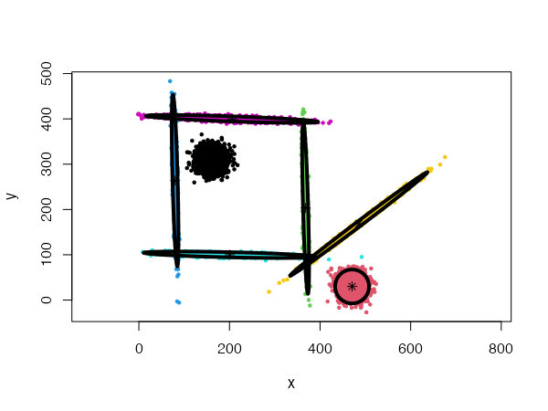
</p>

---

## Discovering clusters by splitting

The `cec` function includes an option to discover new clusters after the initial
clustering has occurred. This is done by recursively trying to split each 
cluster into two smaller clusters that would lower the cost function.

To enable the splitting method, the `split` argument must be set to `TRUE` in 
the `cec` function. For instance: 

```r
data("fourGaussians")
par(mfrow = c(1,2))

# No splitting
cec <- cec(fourGaussians, centers = 1, type = "all")
plot(cec, asp = 1, main = "No splitting")

# With splitting
cec <- cec(fourGaussians, centers = 1, type = "all", split = TRUE)
plot(cec, asp = 1, main = "With splitting")
```

<p align="center">
  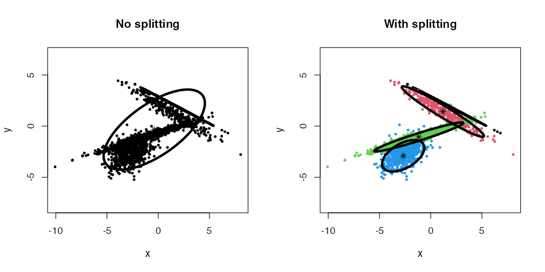
</p>

Combined with the `nstart` parameter, the whole procedure, from start to end 
(initial clustering and splitting), can be repeated multiple times. In this, 
case we can also use multiple threads to speed the process up (`threads` 
parameter).

Note that the splitting method will be used implicitly when the `centers` 
argument is not provided.

```r
data("mixShapes")
cec <- cec(mixShapes)
plot(cec, asp = 1)
```

<p align="center">
  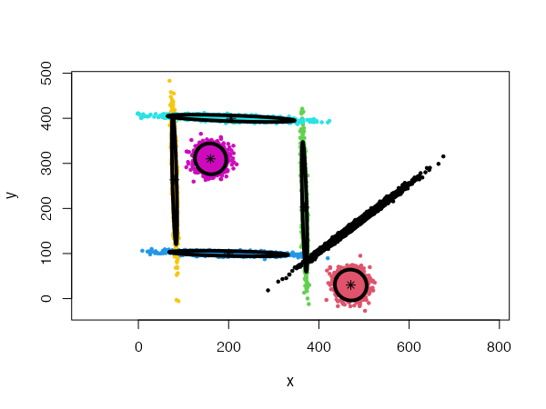
</p>

Finally, four parameters control the splitting mode: `split.depth`, `split.tries`, 
`split.limit`, and `split.initial.starts`. The description of those parameters 
and their default values are provided in the package manual. They can be useful
to help the algorithm produce meaningful clustering in more complex situations. 

For instance, we can generate a data set of 20 Gaussians with the following code:

```r
twenty.gaussians <- matrix(NA, 0, 2)
for (i in 0:19) {
    G <- matrix(rnorm(400), 200, 2)
    G[,1] <- G[,1] + i %% 5 * 8 + stats::runif(1,-1, 1)
    G[,2] <- G[,2] + i %/% 5 * 8 + stats::runif(1,-1, 1)
    twenty.gaussians <- rbind(twenty.gaussians, G)
}
```

Using a general Gaussian distributions model (`type = 'all'`) and no initial 
centers, the algorithm finds easily the 20 Gaussian clusters, and we only need 
to provide it with a low `card.min` value.

```r
cec <- cec(twenty.gaussians, card.min="1%")
plot(cec, asp = 1)
```

<p align="center">
  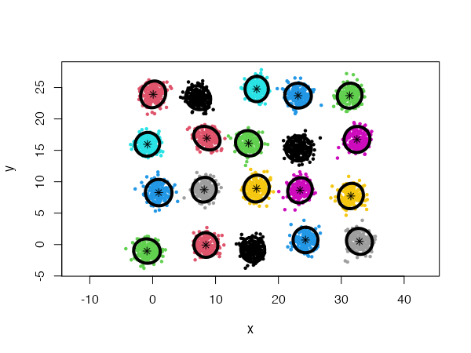
</p>

However, using spherical densities (`type = 'spherical'`) on the same data set
will lead to sub-optimal results: 

```r
cec <- cec(twenty.gaussians, type = "spherical", card.min="1%")
plot(cec, asp = 1)
```

<p align="center">
  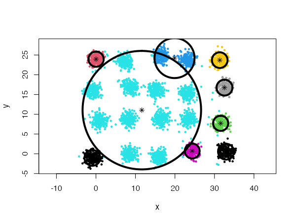
</p>

We can help the algorithm identify a more satisfying solution by playing with 
the `split.depth` and `split.tries` parameters, for instance.

```r
cec <- cec(twenty.gaussians, type = "spherical", card.min="1%", 
    split.depth = 25, split.tries = 15)
plot(cec, asp = 1)
```

<p align="center">
  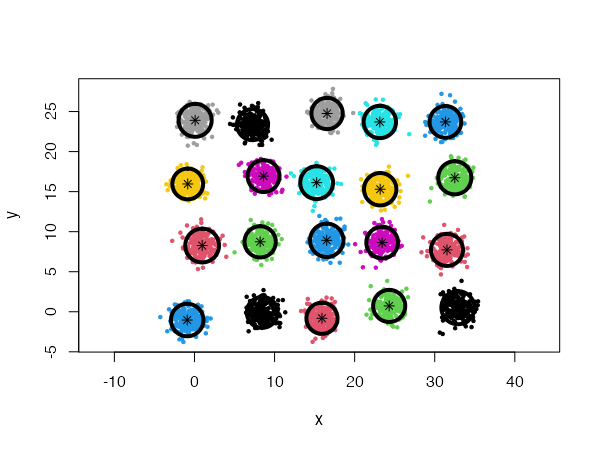
</p>
